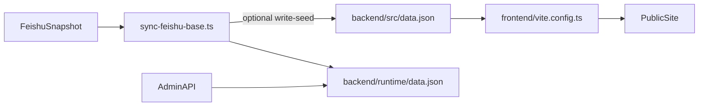

# 数据流与真源定义

## 目标

确保网站内容在开发、构建、运行、外部同步四个环节中有清晰边界，避免“多处同时改导致不一致”。

## 真源优先级

1. `backend/src/data.json`：开发与构建真源（SSG 路由依赖）
2. `backend/runtime/*.json`：运行时状态与临时持久化
3. 飞书快照输入：外部数据来源，只负责导入，不直接渲染页面

## 流程图

## 实施规则

- 构建前如需纳入最新内容，必须确认 `backend/src/data.json` 已同步。
- 运行中后台写入默认落在 `backend/runtime/`，用于快速迭代与审核运营。
- 外部同步脚本可选择回写 seed，但必须在变更说明中明确。

## 相关文件

- `frontend/vite.config.ts`
- `backend/src/scripts/sync-feishu-base.ts`
- `backend/src/feishu/sync.ts`
- `backend/src/data.json`

