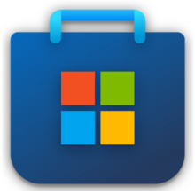

# ✏️ 屏幕批注与白板软件

> 替代系统自带臃肿白板，提供更轻量的屏幕画笔和批注功能。

[⬅️ 返回主页](../README.md)

---

## Ink Canvas

> 该项目已经停更。

Ink Canvas 画板是一款轻量级画板软件，基于 WPF/C#，其针对希沃一体机进行了特别优化，与预装的“希沃白板 5”软件相比，启动速度大幅度提升（提升 5-10 倍），系统资源占用更小，使用体验更佳。

🏷 **关键词**： 
 
 
 
 
 
 

💬 **Dubi906w 锐评**：某种意义上来说，如果你想要一个纯粹的屏幕画板，IC 可以是你的选择之一，同时它的诞生，也才有了后面 ICA 和 ICC 的诞生。如果要在教室里面使用不是很合适。

<table align="center">
<tr>
    <td></td>
    <td><b>GitHub 1</b></td>
    <td><a href="https://github.com/WXRIW/Ink-Canvas/">https://github.com/WXRIW/Ink-Canvas/</a></td>
</tr>
<tr>
    <td></td>
    <td><b>GitHub 2</b></td>
    <td><a href="https://github.com/InkCanvas/Ink-Canvas/">https://github.com/InkCanvas/Ink-Canvas/</a></td>
</tr>
<tr>
    <td></td>
    <td><b>微软商店</b></td>
    <td><a href="https://www.microsoft.com/store/apps/9NXJFDD97XJ3?cid=ghreadme">https://www.microsoft.com/store/apps/9NXJFDD97XJ3?cid=ghreadme</a></td>
</tr>
</table>

  

---

## Ink Canvas Plus

Ink Canvas Plus 是一款由 Clover Yan 维护、复刻自 WXRIW/Ink Canvas 的 Windows 画板应用，旨在优化各方面的使用体验，并尽可能保留原版 Ink Canvas 的操作体验。

🏷 **关键词**： 
 
 
 
 
 
 
 

💬 **2,2,3-三甲基戊烷 锐评**：俗话说的好：“要稳定inkeys，要好用icp。”而其中的icp便是原版ic的延续，继承了原版ic简洁易用的特点。

💬 **Makitoid 锐评**：作为批注软件还是很不错的，但是作为白板软件还是差一点。希望持续的优化！

<table align="center">
<tr>
    <td></td>
    <td><b>GitHub</b></td>
    <td><a href="https://github.com/clover-yan/Ink-Canvas-Plus">https://github.com/clover-yan/Ink-Canvas-Plus</a></td>
</tr>
<tr>
    <td></td>
    <td><b>蓝奏云下载</b></td>
    <td><a href="https://cloveryan.lanzoum.com/b00y42aebi">https://cloveryan.lanzoum.com/b00y42aebi</a></td>
</tr>
</table>

  

---
